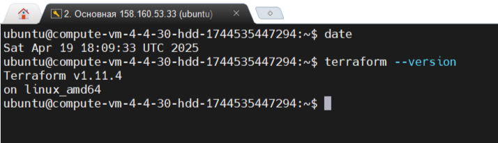
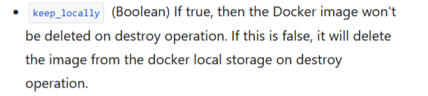

# Введение в Terraform  

Подготовка:  
1. Установка Terraform, инструкция https://yandex.cloud/ru/docs/tutorials/infrastructure-management/terraform-quickstart  
`terraform --version`  
  

## Задание 1  
1. Скачать зависимости  
`terraform init`  
  
`terraform apply`  
  
State-файл содержит чувствительные данные, добавлю в .gitignore  
`echo "terraform.tfstate" >> .gitignore`  


2. Согласно .gitignore, допустимо сохранять личную, секретную информацию в файле personal.auto.tfvars, так как он явно указан для хранения секретных переменных и игнорируется, чтобы не попадать в репозиторий.  

3. Найдите в state-файле секретное содержимое созданного ресурса random_password  
Секретное содержимое ресурса random_password:  
        Ключ: `result`  
        Значение: `9ND9Jmx3CdH46utc`  
    Что это за секретный ключ и риски утечки:  
        Ключ result — это сгенерированный случайный пароль длиной 16 символов, созданный ресурсом random_password.random_string.  
        Этот пароль может использоваться для аутентификации или в имени ресурсов (например, в имени Docker-контейнера, как в закомментированном коде `main.tf`).  
        Утечка этого пароля может привести к:  
            - Несанкционированному доступу к ресурсам, использующим этот пароль (например, к контейнеру или ВМ).  
            - Компрометации инфраструктуры, если пароль используется в цепочке ресурсов.  
            - Финансовым и репутационным рискам в продакшене, а в учебной среде — к потере контроля над ресурсами Yandex Cloud.  
        Для предотвращения утечки state-файл добавлен в `.gitignore`/  


4. Выполните команду `terraform validate`. Объясните, в чём заключаются намеренно допущенные ошибки.  

**Ошибки выполнения команды:  
**Error: Missing name for resource**  
В коде для ресурса docker_image указано только тип ресера (docker_image), уникальное имя отсутвует.  
**Error: Invalid resource name**  
- Имя ресурса docker_container — 1nginx — начинается с цифры (1), что недопустимо.  
- Имя ресурса должно начинаться с буквы или подчёркивания и может содержать только буквы, цифры, подчёркивания и дефис  
**Опечатки в ссылке на `random_password`**  
В строке name = "example_${random_password.random_string_FAKE.resulT}":  
    - random_password.random_string_FAKE — неправильное имя ресурса. В вашем main.tf ресурс называется random_password.random_string, а не random_string_FAKE.  
    - resulT — опечатка. Правильный атрибут — result (с маленькой буквы).  

Исправляю ошибки и повторно выполяю:  
`terraform validate`  
  

5. Выполните код.  
`terraform apply`  
**Исправленный main.tf:**  
```hcl  
terraform {  
  required_providers {  
    docker = {  
      source  = "kreuzwerker/docker"  
      version = "~> 3.0.1"  
    }  
  }  
  required_version = ">=1.8.4" /*Многострочный комментарий.  
 Требуемая версия terraform */  
}  
provider "docker" {}  

#однострочный комментарий  

resource "random_password" "random_string" {  
  length      = 16  
  special     = false  
  min_upper   = 1  
  min_lower   = 1  
  min_numeric = 1  
}  


resource "docker_image" "nginx" {  
  name         = "nginx:latest"  
  keep_locally = true  
}  

resource "docker_container" "nginx" {  
  image = docker_image.nginx.image_id  
  name  = "example_${random_password.random_string.result}"  

  ports {  
    internal = 80  
    external = 9090  
  }  
}  
```  
Повторно выполяю:  
`docker ps`  
  
  
6. Замените имя docker-контейнера в блоке кода на hello_world  
**Исправленный блок:**  
```hcl  
resource "docker_container" "nginx" {  
  image = docker_image.nginx.image_id  
  name  = "hello_world"  

  ports {  
    internal = 80  
    external = 9090  
  }  
}  
```  
Выполняю команду:   
`terraform apply -auto-approve`  

**Объясните своими словами, в чём может быть опасность применения ключа -auto-approve?**  
Флаг -auto-approve заставляет Terraform применять изменения без интерактивного подтверждения. Это может быть опасно, потому что:  

    - Нет возможности проверить план: Обычно terraform apply показывает план изменений (что будет создано, изменено или удалено) и ждёт подтверждения (yes).  
    - Ошибки в коде: Если в main.tf есть ошибка (например, неправильное имя ресурса или неверный параметр), флаг -auto-approve не даст времени заметить проблему.  
    - Автоматизация без контроля: В проде это может привести к непредвиденным сбоям, если изменения затрагивают работающие сервисы.  

**Догадайтесь или нагуглите зачем может пригодиться данный ключ?**  
Флаг -auto-approve полезен при автоматизации где нельзя интерактивно вводить yes, к примеру в случаях:  
    - CI/CD.  
    - Тестирование и разработка.  
    - Скрипты.  

  

7. Уничтожение ресурсов с помощью Terraform  

Уничтажаю ресурсы, с ключем -auto-approve:  
`terraform destroy -auto-approve`  
*-auto-approve - не справшивать разрешения на удаление*  
  
  

8. Объясните, почему при этом не был удалён docker-образ nginx:latest  

**Ответ:**  
В main.tf для ресурса docker_image.nginx установлен атрибут keep_locally = true:  
```hcl  
resource "docker_image" "nginx" {  
  name         = "nginx:latest"  
  keep_locally = true  
}  
```  
Это означает, что при выполнении terraform destroy Terraform не удаляет сам Docker-образ nginx:latest из локального хранилища Docker, а только убирает его из своего состояния (terraform.tfstate). Поэтому образ остался на машине, что видно в выводе docker images.  
Подтверждение из документации:  
https://registry.terraform.io/providers/kreuzwerker/docker/latest/docs/resources/image  

  


# Задание 2  
Создал проект Terraform с файлами:
[main.tf](task_2/main.tf)
[variables.tf](task_2/variables.tf)
personal.auto.tfvars
[.gitignore](task_2/.gitignore)  

Использую провайдер yandex-cloud/yandex для работы с Yandex Cloud.  
Запускаю скрипт под сервисным аккаунтом:  
  В `main.tf` указал ключ сервисного аккаунта.  
Вынес `cloud_id`, `folder_id` и `subnet_id` в файл` personal.auto.tfvars`.  
Добавил `personal.auto.tfvars` и другие чувствительные файлы в `.gitignore` для безопасности.  
Запуск проекта: 
```sh 
terraform init  
terraform plan  
terraform apply  
```
Установил Docker  
```sh  
curl -fsSL https://get.docker.com -o get-docker.sh  
sudo sh get-docker.sh  
sudo usermod -aG docker $USER  
exit  
docker version  
```  
Настроил remote Docker context:  
```sh  
docker context create remote-vm --docker "host=ssh://Ubuntu@109.191.54.132"  
docker context use remote-vm  
```  
Проверка:  
`docker info`  
  

Запуск контейнера MySQL через Terraform  
`terraform init`  
`terraform apply`  
Получил результат: контейнер mysql_df465053 запущен.  
  

Проверил ENV-переменные
```sh  
docker ps  
docker exec -it mysql_df465053 bash  
env  
```  
  